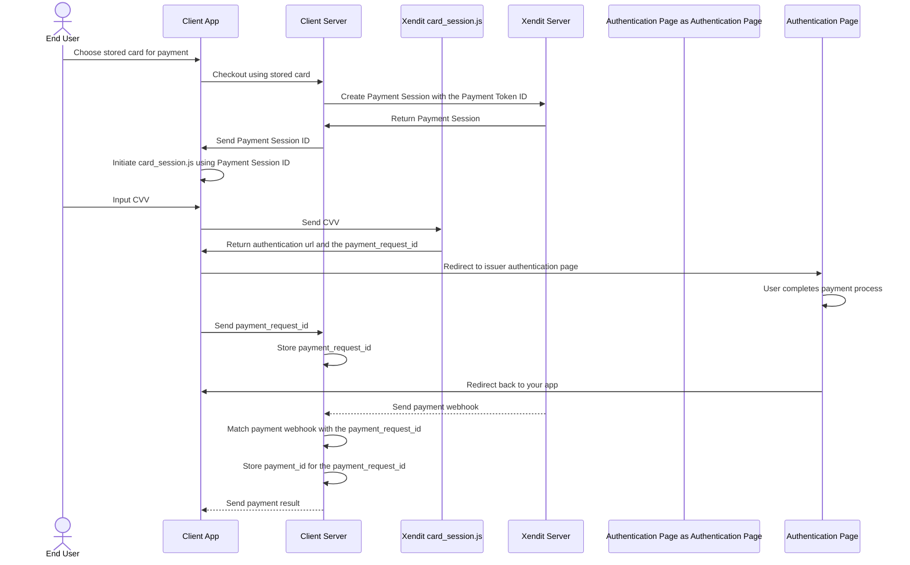

Including the Card Verification Number (CVN) is crucial for successful card transactions. While often optional, providing the CVN significantly improves approval rates, especially for European cards which commonly decline without it. To facilitate secure, one-click payments, you can enable end-users to reuse their stored card details while still requiring CVN and authentication for every transaction.

## One-click payment flow

[Once a card is stored](/v1/docs/store-a-card-for-one-click), you can use the payment\_token\_id for future payments. For added security, your customers may be required to re-enter their CVN during one-click payments, ensuring compliance and reducing fraud risk.



## How to Implement

1. Create a payment session

   Initiate a payment session by sending a POST request to the `/sessions` endpoint. This request should include the `card_payment_token_id` of the stored card.

   Request - POST /sessions

   ```json
   {
       "reference_id": "YOUR_PAYMENT_REFERENCE_ID",
       "session_type": "PAY",
       "mode": "CARDS_SESSION_JS",
       "amount": 100000,
       "currency": "IDR",
       "country": "ID",
       "customer": {
           "reference_id": "YOUR_CUSTOMER_REFERENCE",
           "type": "INDIVIDUAL",
           "email": "test@yourdomain.com",
           "mobile_number": "+6212345678",
           "individual_detail": {
               "given_names": "Jaap",
               "surname": "Stam"
           }
       },
       "cards_session_js": {
           "card_payment_token_id":"pt-a15a6c28-c65a-4ede-a6cc-10ff3b1d093e",
           "success_return_url": "https://yourcompany.com/success",
           "failure_return_url": "https://yourcompany.com/failure"
       }
   }
   ```

   Response - POST /sessions

   ```json
   {
       "payment_session_id": "ps-6746c1006b7752b4d91725af",
       "created": "2024-11-27T06:49:36.535Z",
       "updated": "2024-11-27T06:49:36.535Z",
       "status": "ACTIVE",
       "reference_id": "YOUR_PAYMENT_REFERENCE_ID",
       "currency": "IDR",
       "amount": 10000,
       "country": "ID",
       "customer_id": "XENDIT_GENERATED_CUSTOMER_ID",
       "expires_at": "2024-11-27T07:19:36.434Z",
       "session_type": "PAY",
       "mode": "CARDS_SESSION_JS",
       "locale": "en",
       "business_id": "YOUR_BUSINESS_ID", 
       "cards_session_js": {
           "card_payment_token_id":"pt-a15a6c28-c65a-4ede-a6cc-10ff3b1d093e",
           "success_return_url": "https://yourcompany.com/success",
           "failure_return_url": "https://yourcompany.com/failure"
       }
   }
   ```

2. Collect the CVN

Implement `card_session.js` in the head element of your payment page.

```xml
&lt;head&gt;
     &lt;script type="text/javascript" src="https://js.xendit.co/cards-session.min.js"&gt;
&lt;/head&gt;
```

Then, collect the CVN information

```xml
&lt;head&gt;
    &lt;script type="text/javascript" src="https://js.xendit.co/cards-session.min.js"&gt;
&lt;/head&gt;

&lt;body&gt;
    &lt;div class="credit-card-form"&gt;
        &lt;form id="credit-card-form"&gt;
            &lt;div class="form-group"&gt;
                &lt;label for="cvn"&gt;CVN&lt;/label&gt;
                &lt;input type="text" id="cvn" name="cvn" placeholder="123" /&gt;
            &lt;/div&gt;
        &lt;/form&gt;
    &lt;/div&gt;
    &lt;script type="text/javascript"&gt;

    &lt;/script&gt;
&lt;/body&gt;
```

Request - to card\_session\_js

```json
{
    "cvn": "123",
    "payment_session_id": "YOUR_PAYMENT_SESSION_ID"
}
```

Response - from card\_session\_js

```json
{ 
    "message": "Status updated. Wait for a callback or get the status using the Get API.", 
    "payment_request_id": "PAYMENT_REQUEST_ID", 
    "action_url": "AUTHENTICATION_PAGE_URL" 
}
```

Important:Store the `payment_request_id` as it is crucial for tracking the transaction status and will be included in the payment webhook.

3. Redirect to the authentication page

Redirect your customer to the [authentication page](/accept-payments/integration-guide/card-payments-via-api/cards-authentication-3ds2) provided by the `action_url` from the response object. This is where the cardholder completes the 3D Secure authentication.

4. Customer completes authentication

After successfully authenticating, your customer will be redirected to your `success_return_url`. If authentication fails, they will be redirected to your `cancel_return_url`.

5. Receive the webhook

Xendit will send a payment [webhook](/accept-payments/integration-guide/payments-via-api-1/payments-api-webhooks) to your configured webhook endpoint, indicating the final status of the transaction. You can match this webhook with the `payment_request_id` you stored earlier.

Example `payment.capture` webhook

```json
{
    "created": "2024-12-18T05:46:35.109Z",
    "business_id": "62440e322008e87fb29c1fd0",
    "event": "payment.capture",
    "data": {
        "type": "PAY",
        "status": "SUCCEEDED",
        "country": "ID",
        "created": "2024-12-18T05:46:08.192Z",
        "updated": "2024-12-18T05:46:30.627Z",
        "captures": [
            {
                "capture_id": "cptr-08f17fa3-e80c-4d8e-8c34-17aa3400bc1c",
                "capture_amount": 10000,
                "capture_timestamp": "2024-12-18T05:46:34.234Z"
            }
        ],
        "currency": "IDR",
        "payment_id": "py-3f57d678-2448-4c9f-a433-8468d366fb5c",
        "business_id": "62440e322008e87fb29c1fd0",
        "customer_id": "cust-7de9a9b4-37e8-40ad-b665-d97f42e538c5",
        "channel_code": "CARDS",
        "reference_id": "97ba0a32-b996-4abf-8a7b-6184a6644676_b8d18f2f-3",
        "capture_method": "AUTOMATIC",
        "request_amount": 10000,
        "payment_details": {
            "authorization_data": {
                "reconciliation_id": "7345007929096981703954",
                "authorization_code": "831000",
                "acquirer_merchant_id": "xendit_ctv_agg",
                "network_response_code": "00",
                "network_transaction_id": "016153570198200",
                "cvn_verification_result": "M",
                "retrieval_reference_number": "435205253972",
                "address_verification_result": "M",
                "network_response_code_descriptor": "Approved and completed sucessfully"
            },
            "authentication_data": {
                "flow": "CHALLENGE",
                "a_res": {
                    "eci": "05",
                    "message_version": "2.1.0",
                    "authentication_value": "AAIBBYNoEwAAACcKhAJkdQAAAAA=","directory_server_trans_id": "e537f539-d59f-4ebe-8d56-7fdc31a8e9b4"
                }
            }
        },
        "payment_request_id": "pr-5593127f-8c7b-4d2f-b487-c785ffc21e2f"
    },
    "api_version": "v3"
}
```

It's recommended to save the`payment_id`and`payment_details` from the webhook, correlated with the `payment_request_id`, as proof of payment.

### Example implementation

For a practical demonstration of collecting CVN using `card_session.js` on your frontend, refer to our example page:

🔗 [card\_session.js example to collect CVN](https://js.xendit.co/test_collect_cvn.html)
