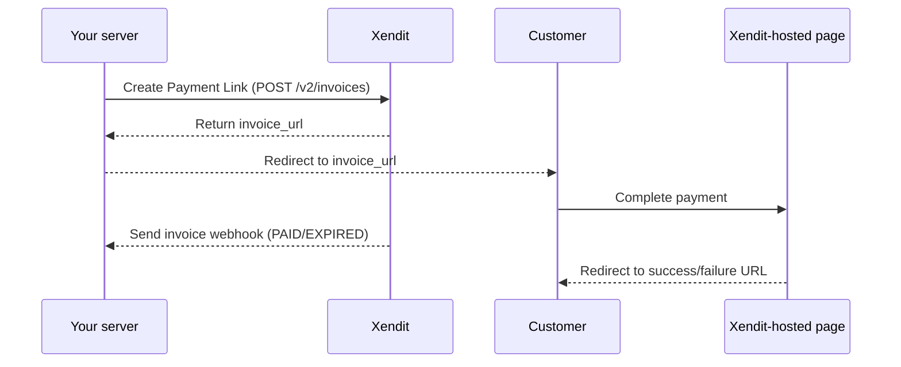
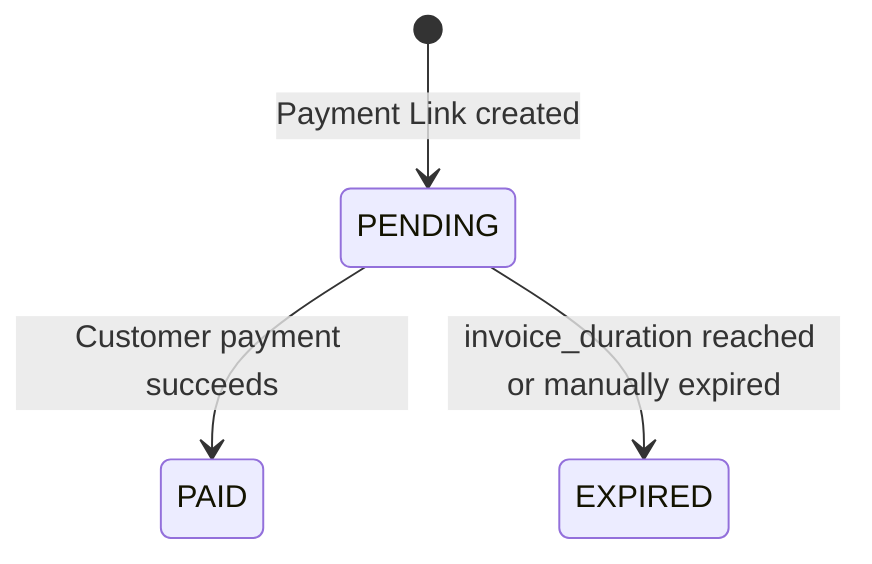

Payment Link provides a simple, low-code solution for one-time payments. Your customers can complete their payments on a Xendit-hosted checkout page, removing the need for you to build a checkout page and processing the payment. Payment confirmations are sent to your webhook for further handling, such as updating your order status.



## How to integrate

1. Create a Payment Link

When the end user is ready to checkout, your server sends a request to Xendit to create a Payment Link using the following endpoint and payload:

| Request - POST /v2/invoices  ```json {   "external_id": "payment-link-example",   "amount": 510000,   "description": "Air Conditioner purchase",   "invoice_duration": 86400,   "customer": {     "given_names": "John",     "surname": "Doe",     "email": "johndoe@example.com",     "mobile_number": "+6287774441111"   },   "success_redirect_url": "https://www.google.com",   "failure_redirect_url": "https://www.google.com",   "currency": "IDR",   "items": [     {       "name": "Air Conditioner",       "quantity": 1,       "price": 100000,       "category": "Electronic",       "url": "https://yourcompany.com/example_item"     }   ],   "metadata": {     "store_branch": "Jakarta"   } }       ``` | Response - POST /v2/invoices  ```json {     "id": "6748105a77f16ebe0cc583a7",     "external_id": "payment-link-example",     "user_id": "62440e322008e87fb29c1fd0",     "status": "PENDING",     "merchant_name": "Your Business Name",     "merchant_profile_picture_url": "https://xnd-merchant-logos.s3.amazonaws.com/business/production/62440e322008e87fb29c1fd0-1721897916022.jpeg",     "amount": 510000,     "description": "Air Conditioner purchase",     "expiry_date": "2024-11-29T06:40:26.353Z",     "invoice_url": "https://checkout-staging.xendit.co/web/6748105a77f16ebe0cc583a7",     "available_banks": [         {             "bank_code": "BNI",             "collection_type": "POOL",             "transfer_amount": 510000,             "bank_branch": "Virtual Account",             "account_holder_name": "YOUR BUSINESS NAME",             "identity_amount": 0         },         {             "bank_code": "MANDIRI",             "collection_type": "POOL",             "transfer_amount": 510000,             "bank_branch": "Virtual Account",             "account_holder_name": "YOUR BUSINESS NAME",             "identity_amount": 0         },         {             "bank_code": "PERMATA",             "collection_type": "POOL",             "transfer_amount": 510000,             "bank_branch": "Virtual Account",             "account_holder_name": "YOUR BUSINESS NAME",             "identity_amount": 0         },         {             "bank_code": "BRI",             "collection_type": "POOL",             "transfer_amount": 510000,             "bank_branch": "Virtual Account",             "account_holder_name": "YOUR BUSINESS NAME",             "identity_amount": 0         },         {             "bank_code": "BCA",             "collection_type": "POOL",             "transfer_amount": 510000,             "bank_branch": "Virtual Account",             "account_holder_name": "YOUR BUSINESS NAME",             "identity_amount": 0         }     ],     "available_retail_outlets": [         {             "retail_outlet_name": "ALFAMART"         },         {             "retail_outlet_name": "INDOMARET"         }     ],     "available_ewallets": [         {             "ewallet_type": "OVO"         },         {             "ewallet_type": "DANA"         },         {             "ewallet_type": "SHOPEEPAY"         },         {             "ewallet_type": "LINKAJA"         },         {             "ewallet_type": "ASTRAPAY"         },         {             "ewallet_type": "NEXCASH"         },         {             "ewallet_type": "JENIUSPAY"         }     ],     "available_qr_codes": [         {             "qr_code_type": "QRIS"         }     ],     "available_direct_debits": [         {             "direct_debit_type": "DD_BRI"         },         {             "direct_debit_type": "DD_MANDIRI"         }     ],     "available_paylaters": [],     "should_exclude_credit_card": true,     "should_send_email": false,     "success_redirect_url": "https://www.google.com",     "failure_redirect_url": "https://www.google.com",     "created": "2024-11-28T06:40:26.508Z",     "updated": "2024-11-28T06:40:26.508Z",     "currency": "IDR",     "items": [         {             "name": "Air Conditioner",             "quantity": 1,             "price": 100000,             "category": "Electronic",             "url": "https://yourcompany.com/example_item"         }     ],     "customer": {         "given_names": "John",         "surname": "Doe",         "email": "johndoe@example.com",         "mobile_number": "+6287774441111"     },     "metadata": {         "store_branch": "Jakarta"     } } ``` |
| --- | --- |

2. Redirect the end user to Xendit-hosted page

Use the `invoice_url` from the response to redirect the customer to the Xendit-hosted checkout page.

3. End user completes payment

The end user completes the payment on the Xendit-hosted page. If the payment is successful, they are redirected to the `success_redirect_url`. If it fails, they can retry the payment again on the same payment page.

Xendit provides clear error messages on the Xendit-hosted page to guide the end user.

4. Receive the webhook

When the payment is completed, Xendit sends a webhook to your configured endpoint.

```json
{
    "id": "6748105a77f16ebe0cc583a7",
    "items": [
        {
            "url": "https://yourcompany.com/example_item",
            "name": "Air Conditioner",
            "price": 100000,
            "category": "Electronic",
            "quantity": 1
        }
    ],
    "amount": 510000,
    "status": "PAID",
    "created": "2024-11-28T06:40:26.508Z",
    "is_high": false,
    "paid_at": "2024-11-28T06:41:29.776Z",
    "updated": "2024-11-28T06:41:34.702Z",
    "user_id": "62440e322008e87fb29c1fd0",
    "currency": "IDR",
    "payment_id": "ewc_99013716-9354-439e-9fea-e61a06e87ea3",
    "description": "Air Conditioner purchase",
    "external_id": "payment-link-example",
    "paid_amount": 510000,
    "ewallet_type": "DANA",
    "merchant_name": "Your Business Name",
    "payment_method": "EWALLET",
    "payment_channel": "DANA",
    "payment_method_id": "pm-8a1e1cc3-b67c-4951-bc1e-470bc94ad816",
    "failure_redirect_url": "https://www.google.com",
    "success_redirect_url": "https://www.google.com"
}
```

## Payment Link lifecycle



Here’s a table summarizing the statuses and their descriptions for the Payment Link lifecycle:

| Status | Description |
| --- | --- |
| Pending | The Payment Link status will be `PENDING` immediately after creation. It remains pending until it is successfully completed, expires (based on the `invoice_duration`), or is manually expired. |
| Paid | The status changes to `PAID` when the payment is successfully completed. If the user fails during the process, they can retry within the same Payment Link. During this state, you will receive an invoice webhook with the status `PAID`. |
| Expired | The status changes to `EXPIRED` when the `invoice_duration` is reached or you manually expire the Payment Link. The end user will no longer have access to the `invoice_url`. During this state, you will receive an invoice webhook to identify the state transition. An expired Payment Link cannot be revived. |

*Please note: There is no REFUNDED status in Payment Link. Refunds will not appear under the Payment Link tab. Please track refund status in the Transaction / Related Payment tab.*
