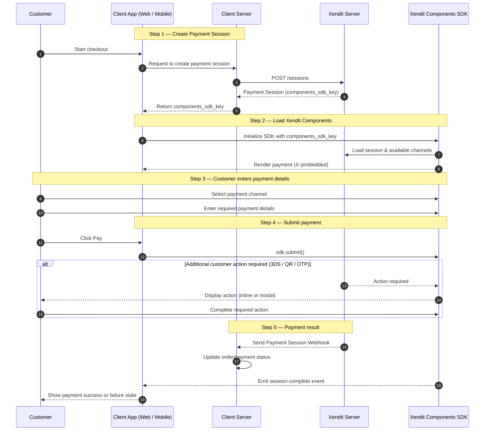

Xendit Components is a client-side payment integration model that allows you to embed Xendit-managed, PCI-compliant payment UI directly into your web or mobile applications powered by Payment Session.

It enables:

- Embedded checkout (no redirect)
- Full control of UI layout and branding
- Secure handling of sensitive payment data
- Reduced PCI compliance scope

## High level flow



There will be 2 scopes of responsibility to integrate with Xendit Components

## Server-side responsibilities

Your server is responsible for:

### 1. Creating Payment Sessions

The server creates a Payment Session using Xendit Secret API key and components-specific settings. Xendit Components supports One time payment, Save payment method, and Pay and save flow.

Mandatory fields:

- `mode = COMPONENTS`
- `session_type = PAY | SAVE | PAY_AND_SAVE`
- `components_configuration.origins`

Example:

```json
{
    "reference_id": "{{$YOUR_REFERENCE_ID}}",
    "session_type": "PAY",
    "mode": "COMPONENTS",
    "amount": 10000,
    "currency": "IDR",
    "country": "ID",
    "customer": {
        "reference_id": "{{$randomUUID}}",
        "type": "INDIVIDUAL",
        "email": "customer@yourdomain.com",
        "mobile_number": "+628123456789",
        "individual_detail": {
            "given_names": "John",
            "surname": "Doe"
        }
    },
    "components_configuration": {
        "origins": ["https://yourwebsite.com"]
    }
}
```

### 2. Returning `components_sdk_key` to client

Xendit responds with a `components_sdk_key`, which the server must return to the client app. `components_sdk_key` is a short-lived, session-specific client key that allows the your client to initialize and use Xendit Components for one Payment Session.

> Important
>
> - `components_sdk_key` is required by the frontend to initialize Xendit Components
> - Expose `components_sdk_key` to your customer frontend application only, don’t store it or log it
> - Never expose your Xendit secret API key

### 3. Handling webhooks

You can register your webhook url [here](https://dashboard.xendit.co/settings/developers#webhooks) to listen Payment Session events.


The server must treat webhooks as authoritative to update the order on your system.

Common events:

- `payment_session.completed`
- `payment_session.expired`

## Client-Side responsibilities

Your client app is responsible for:

### 1. Initialize Xendit Components

Use the `components_sdk_key` returned from your backend to initialize the SDK.

```typescript
import { XenditComponents } from "xendit-components-web";
const components = new XenditSessionSdk({
  componentsSdkKey: components_sdk_key
});
```

For frontend development or testing, you may use `XenditComponents` instead.

### 2. Create channel component

Create and mount the channel component to your checkout page.

```typescript
const channel = components
  .getActiveChannels()
  .find((channel) => channel.channelCode === "CARDS");
if (channel) {
  const htmlElement = components.createChannelPickerComponent(channel);
  myContainer.replaceChildren(htmlElement);
}
```

Use getActiveChannels to return the list of payment channels available for the current payment session and then create channel component for the selected channel.

> Currently Xendit Components only available for CARDS.

### 3. Submit the payment

Trigger submission when the customer clicks your “Pay” button.

```typescript
document
  .getElementById("pay-button")!
  .addEventListener("click", () => {
    components.submit();
  });
```

Submission is only allowed when:

- The session is active
- A payment channel is selected
- All required input fields are valid

You may listen to `submission-ready` and `submission-not-ready` events to enable or disable your button.

### 4. Handle payment completion

Your customer completes the payment directly on your page. Some payment methods may trigger additional actions (e.g. 3DS, QR, OTP), which Xendit Components handles automatically.  
  
On your frontend, listen for success for failure using the session-complete and session-expired-or-canceled events

```typescript
components.addEventListener("session-complete", () => {
  // Payment successful
});
components.addEventListener("session-expired-or-canceled", () => {
  // Payment expired or canceled
});
```

## Guideline references

We provide ready-to-use references to help you get started quickly:

- [GitHub – demo-store](https://github.com/xendit/demo-store)  
   An end-to-end example demonstrating backend session creation and frontend integration with Xendit Components.
- [npm package – xendit-components-web](https://www.npmjs.com/package/xendit-components-web)  
   The official Xendit Components SDK for client-side integration.
