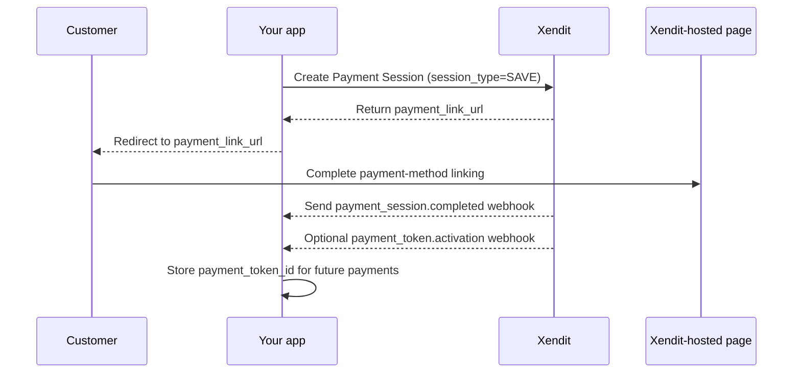

Payment Sessions allow you to securely store your users' payment channels for future transactions. This feature ensures regulatory compliance and simplifies the integration process. Once a payment channel is stored, it can be used for subsequent transactions initiated by either your system or directly by the end-user within your application.

## How to integrate



1. During the end user's registration or via a menu option where users can store their payment channels, your system should Create a Payment Session with Xendit using the example payload provided below.

   | Request - POST /sessions  ```json {     "reference_id": "{{$randomUUID}}",     "session_type": "SAVE",     "mode": "PAYMENT_LINK",     "amount": 0,     "currency": "IDR",     "country": "ID",     "customer": {         "reference_id": "{{$randomUUID}}",         "type": "INDIVIDUAL",         "email": "test@yourdomain.com",         "mobile_number": "+6212345678",         "individual_detail": {             "given_names": "Lorem",             "surname": "Ipsum"         }     },     "channel_properties": {         "cards": {             "card_on_file_type": "RECURRING",             "recurring_configuration": {                 "recurring_frequency": 30,                 "recurring_expiry": "2025-12-31"             }         }     },     "success_return_url": "https://yourcompany.com/example_item=my_example_item",     "cancel_return_url": "https://yourcompany.com/example_item=my_example_item" } ``` | Response - POST /sessions  ```json {     "payment_session_id": "ps-690a210bb6b78faccd6297a4",     "created": "2025-11-04T15:51:39.867Z",     "updated": "2025-11-04T15:51:39.867Z",     "status": "ACTIVE",     "reference_id": "abaa87a4-7eff-45bf-bc6a-1cf95685112f",     "currency": "IDR",     "amount": 0,     "country": "ID",     "expires_at": "2025-11-04T16:21:39.470Z",     "session_type": "SAVE",     "mode": "PAYMENT_LINK",     "locale": "en",     "business_id": "610d01ea382dd240ac8f913d",     "customer_id": "cust-3ec9f5e2-ac9e-4c43-ba97-cb0ac81a388e",     "channel_properties": {         "cards": {             "card_on_file_type": "RECURRING",             "recurring_configuration": {                 "recurring_frequency": 30,                 "recurring_expiry": "2025-12-31"             }         }     },     "success_return_url": "https://yourcompany.com/example_item=my_example_item",     "cancel_return_url": "https://yourcompany.com/example_item=my_example_item",     "payment_link_url": "https://dev.xen.to/imUYTmg0" } ``` |
   | --- | --- |

   1. For Cards, it's recommended to specify `channel_properties.cards.card_on_file_type` during Payment Session creation. This field indicates the intended use of the payment token for subsequent transactions—whether RECURRING, MERCHANT\_UNSCHEDULED, or CUSTOMER\_UNSCHEDULED. Properly setting this value can significantly improve transaction success rates.
2. Once the Payment Session is created, redirect your end user to the Xendit-hosted page using the `payment_link_url` from the response.
3. Your end user will complete their linking process on Xendit-hosted page
4. Upon successful linking, Xendit will send a `payment_session.completed` this webhook contains the `payment_token_id`, which you should securely store for future use. Optionally, you can handle `payment_token.activation`webhook to your system to get the token details.

   You can use the `payment_token_id` for:

   - Future one-off payments: Refer to the [Pay with Tokens](/accept-payments/integration-guide/payments-via-api-1/pay-with-tokens) guide
   - Subscription transactions: Refer to the guides on [Fixed Amount Subscriptions](/accept-payments/integration-guide/subscriptions-1/fixed-amount-subscriptions) or [Usage-Based Subscriptions](/accept-payments/integration-guide/subscriptions-1/usage-based-subscriptions).
