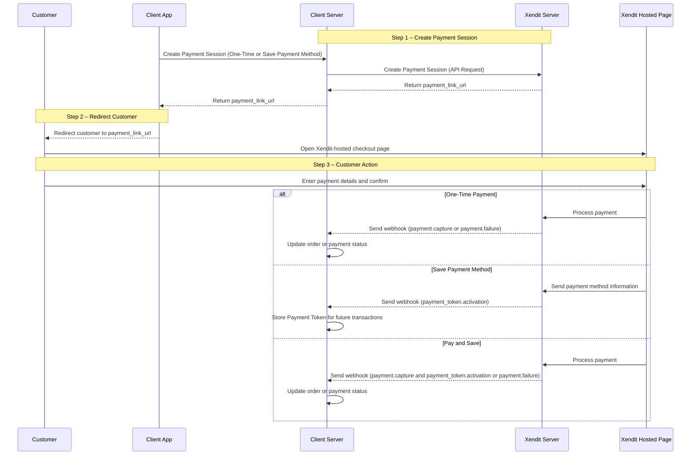
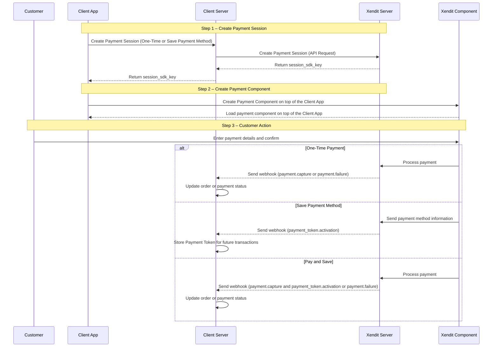
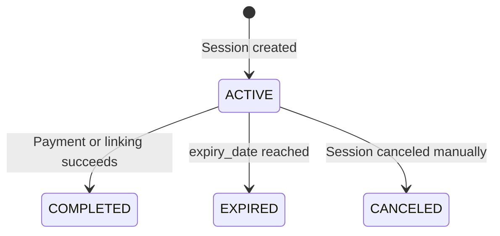

This guide introduces the technical architecture, session model, and integration options for Xendit Payment Session.

Payment Session provides a unified abstraction for collecting payments and saving payment methods, while allowing you to choose how the checkout UI is delivered—either through a Xendit-hosted page or embedded directly into your application.

For business use cases and product benefits, see [Payment Session Overview Page](/accept-payments/payment-products/payment-sessions-1/how-payment-sessions-work#supported-interfaces).

## What is a Payment Session?

A Payment Session is a secure, stateful object created on Xendit that manages the full lifecycle of a payment or payment-method-linking flow.

A session:

- Represents one customer checkout context
- Supports multiple payment attempts
- Tracks status, expiry, and completion
- Emits webhooks to notify your system of state changes

Each Payment Session can be completed through one of two integration modes, depending on how you want to present the payment UI.

## Core Concepts

### Session Type

Session type defines what the session does.

| session\_type | Description |
| --- | --- |
| `PAY` | Collects a payment. Can optionally save the payment method. |
| `SAVE` | Saves a payment method without charging the customer. |

---

### Saving Payment Methods in PAY Sessions

For `PAY` sessions, you can control payment-method saving behavior using `allow_save_payment_method`.

| Value | Behavior |
| --- | --- |
| `disabled` | Payment only. No payment token is created. |
| `optional` | Customer can choose whether to save the payment method. Checkbox option will be displayed. |
| `forced` | Payment method is always saved after a successful payment. |

---

### Integration Mode

Integration mode defines how the payment UI is delivered.

| Mode | UI Delivery |
| --- | --- |
| `PAYMENT_LINK` | Redirect to Xendit-hosted checkout page |
| `COMPONENTS` | Embedded secure payment fields |

## Payment Mode Options

### `PAYMENT_LINK` Mode (Xendit-Hosted)

Payment link mode simplifies payment collection and payment method management through a Xendit-hosted checkout page.

- Your server creates a Payment Session
- Xendit returns a `payment_link_url`
- You redirect the customer to Xendit
- Xendit hosts and manages the checkout UI
- Payment results are delivered via webhooks

Depending on your use case, you can follow the guideline to integrate with Payment Link mode for either [One-Time Payment](/accept-payments/integration-guide/payment-sessions/payment-link-1/payment-1),Save Payment Method or Pay and Save.

### `COMPONENTS` Mode (Embedded)

Component mode allows you to embed secure, PCI-compliant payment fields directly into your own website. This ensures a seamless user experience where customers never leave your domain, while Xendit handles the payment processes.

Depending on your integration, the flow can be configured for One-Time Payment, Save Payment Method, or Pay and Save.

1. Create a Payment Session with `"mode": "COMPONENTS"` from your server for either a One-Time Payment or to Save Payment Method to get Xendit’s `components_sdk_key`.
2. Use Xendit’s Component SDK on your checkout page. Provide the `components_sdk_key` when load the Xendit’s Component SDK embedded on your checkout page.
3. The customer will enter payment details and confirms the transaction inside the embedded component on your checkout page
4. Payment Flow

   - One-Time Payment: Xendit processes the payment and sends a webhook `payment.capture` or `payment.failure`). Your system updates the order.
   - Save Payment Method: Xendit links the payment method and sends a webhook `payment_token.activation`). Your system stores the Payment Token for future charges.
   - Pay and Save Method: Xendit processes the payment & links the payment method for successful payment `payment.capture` & `payment_token.activation`). Your system updates the order and stores the Payment Token for future charges.
5. Future Charges (Optional for Pay and Save and Save Payment Method)

   - When ready to charge the customer, create a [Payment Request using the stored Payment Token](/accept-payments/integration-guide/payments-via-api-1/pay-with-tokens).
   - The customer does not need to re-enter payment details, simplifying recurring or repeat payments.

Key Notes: All flows use a Xendit-hosted page for secure, PCI-compliant handling of payment details. Find out more about [PCI-DSS compliance](https://docs.xendit.co/docs/pci-dss-compliance?highlight=saq).

## Available Session Type

| Session type | Description |
| --- | --- |
| `SAVE` | Use this type to save only the end user's payment information. You will receive a `payment_token_id` that can be used for future transactions. This is useful if your registration event is separate from your payment event, or if you need the user to store their payment method before initiating a payment (e.g., for recurring payments registration). |
| `PAY` | Use this type to collect a single payment. You will receive a payment session object contains `payment_request_id` as the payment confirmation. Additionally, you can also obtain a `payment_token_id` if you set up `PAY` and store the payment method details in one go. |

## Payment Session Lifecycle

A payment session's status changes throughout its lifecycle, marking different stages of the payment or linking process.

| Status | Description | Webhook event |
| --- | --- | --- |
| Active | The Payment Session status will be ACTIVE immediately after creation. It remains active until it is successfully completed, expires (based on the `expiry_date`), or is manually canceled. |  |
| Completed | The status changes to COMPLETED when the payment or linking process (depending on the chosen flow) is successfully finished. If the user fails during the process, they can retry within the same session. During this state you will receive `payment_session.completed` webhook to identify you the state transition. | `payment_session.completed` |
| Expired | The status changes to EXPIRED when the `expiry_date` set during Payment Session creation is reached, and an expired Payment Session cannot be reactivated. During this state you will receive `payment_session.expired` webhook to identify you the state transition. | `payment_session.expired` |
| Canceled | If the Payment Session is manually canceled, the status changes to CANCELED immediately. The end user will no longer have access to the `payment_link_url`, and a canceled Payment Session cannot be reactivated. |  |
