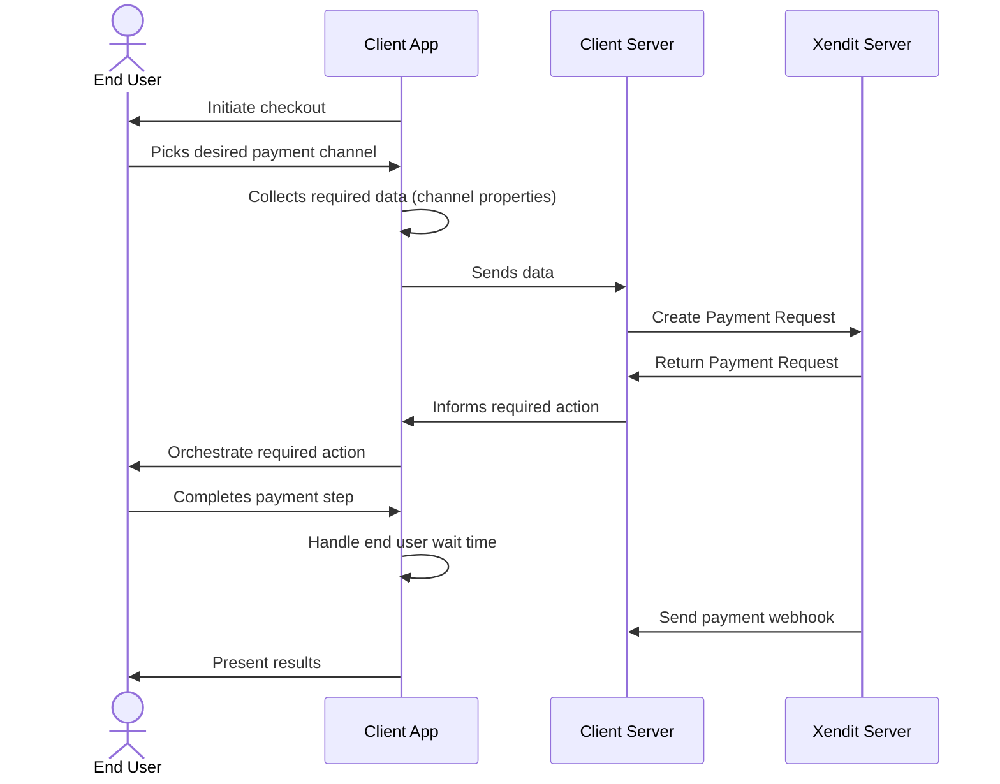
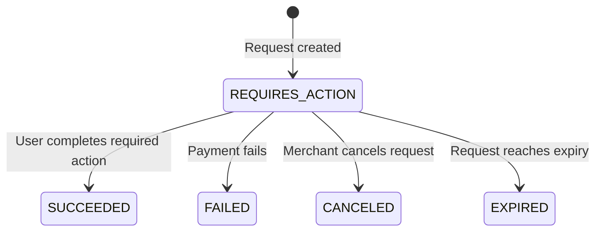
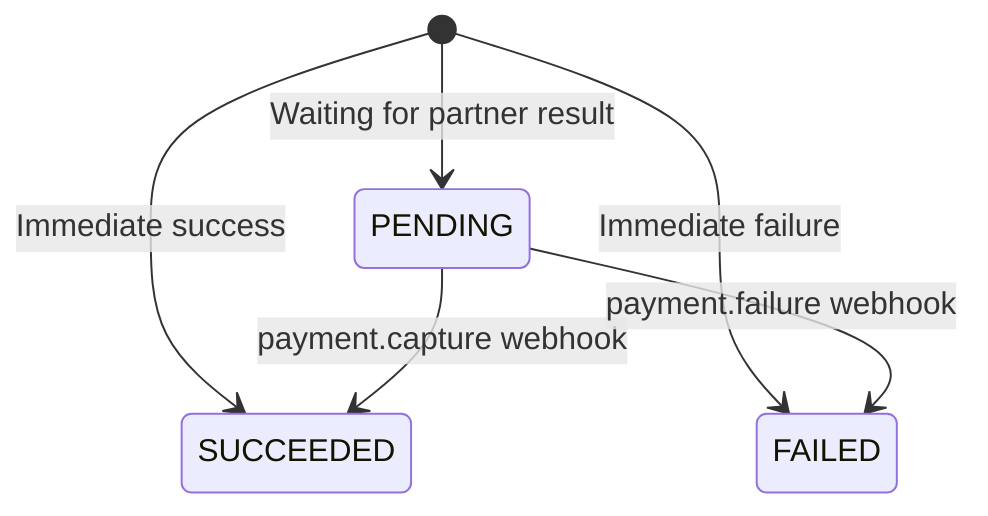

import CreatePrPay from '/snippets/payments-api/create-pr-pay.mdx'
import PaymentRequestWebhookPay from '/snippets/payments-api/payment-request-webhook-pay.mdx'

The most basic form of a transaction is a guest checkout, also called a one-off payment. Guest checkout is used by most merchants as the starting point of payments collection before moving on to more advanced flows to optimize success rates.

In this article, we will walk through a basic integration with our payments API for our guest checkout under the `PAY` flow type of `/payment_requests`. Before you start, be sure to complete your integration environment setup.

## A. Integration Flow

## B. How to integrate

1. Create a checkout page for the chosen payment channel

   On your application, prepare a checkout flow to facilitate payment steps that the end user will go through. For the first step, create a checkout page where payment channels are displayed. The end user will pick their desired payment channel here.  
     
   Xendit recommends that you curate the list of payment channels based on preferred payment channels by the end user group that you are targeting. Other considerations might include costs or payment amount limits.
2. Collect required data for the chosen payment channel   
   Once the end user picks a channel, collect the data required to initiate a payment with the payment method provider.
3. Create a payment request   
   Construct an [API request body](https://xendit-docs.document360.io/apidocs/create-payment-request) with information required by your selected channel. In the guest checkout scenario, your payment request `type` should be `PAY`.

   <CreatePrPay />

   Additional features can be configured if the payment channel allows it. For example, you will be able to set custom payment request expiry time if the channel properties fields accepts an expires\_at parameter.
4. Handle the required actions

   Upon successful creation of a payment request with Xendit, you will receive our payment request object. If the payment request status is `REQUIRES_ACTION`, you will need to perform some actions on the client app for the end user to complete payment. If no actions are required, the final payment status will be returned synchronously and a webhook with payment status update will be sent.

   1. Present to customer

      1. Action "type": "PRESENT\_TO\_CUSTOMER"
      2. On the client app, display the action’s value to the user. If it is a QR string, you might need to render it into a scannable QR code. To maximize payment success rates, you should include some payment instructions alongside the displayed values.
   2. Redirection

      1. Action "type": "REDIRECT\_CUSTOMER"
      2. On the client app, redirect the user to the url in action’s value. To maximize payment success rates, you should handle the redirection based on the user’s device type. Note that for certain payment channels, there are redirections rules for pending or cancellation. Your application should be designed to handle such scenarios.
5. Receive a payment event webhook for payment confirmation  
   Once the end user has completed their payment authentication step and the payment method provider notifies Xendit of an update, Xendit will proceed to send a webhook to the webhook url you configured in your Xendit dashboard settings page.

   <PaymentRequestWebhookPay />
6. Display payment status to user

   With the webhook status, you should be able to complete the payment journey for the end user by successfully completing the transaction or directing them back for a retry if it had failed.   
     
   In all real time messaging systems, there is a chance that the webhook does not reach your system. Your application should also cater for the scenario where a webhook is not received while the end user is still waiting on their screen. In such cases, it is recommended for a pending payment notice to be given to the end user while you wait for a webhook from Xendit.

## C. Status Lifecycle

#### User action required

Here’s the status lifecycle for a payment request that requires user action:

| Status | Description | Webhook Event |
| --- | --- | --- |
| REQUIRES\_ACTION | The payment request enters this status synchronously upon API response if user action is required to complete authorization. Handle the `actions` object in this stage. | - |
| SUCCEEDED | The payment request transitions to this status when the payment is successfully completed. Xendit will send the payment.capture webhook containing the `payment_request_id` to identify the request. You should store the `payment_id` for payment proof. | payment.capture |
| FAILED | The payment request transitions to this status when the payment fails. Xendit will send the payment.failure webhook containing the `payment_request_id` to identify the request. Check the `failure_code` to determine the next action.  Note: Not all payment channels provide notifications for failed payment. | payment.failure |
| CANCELED | You can cancel a payment request that is in the `REQUIRES_ACTION` status. Canceling immediately transitions the payment request to `CANCELED`, and the end user will no longer be able to complete the `actions`. | - |
| EXPIRED | The payment request transitions to this status when it expires due to the payment partner’s expiry. |  |

#### No user action required

Here’s the status lifecycle for a payment request that has no action required:

| Status | Description | Webhook Event |
| --- | --- | --- |
| SUCCEEDED | The payment request transitions to this status synchronously when the payment is immediately successful. You will still receive the payment.capture webhook containing payment details. | payment.capture |
| FAILED | The payment request transitions to this status synchronously when the payment is immediately failed. You will still receive the payment.failure webhook.  Note: Not all payment channels provide notifications for failed payment. | payment.failure |
| PENDING | The payment request enters this status synchronously upon API response if the payment partner has not yet responded with a payment result. Wait for the payment webhook to arrive at your configured webhook URL. | - |
