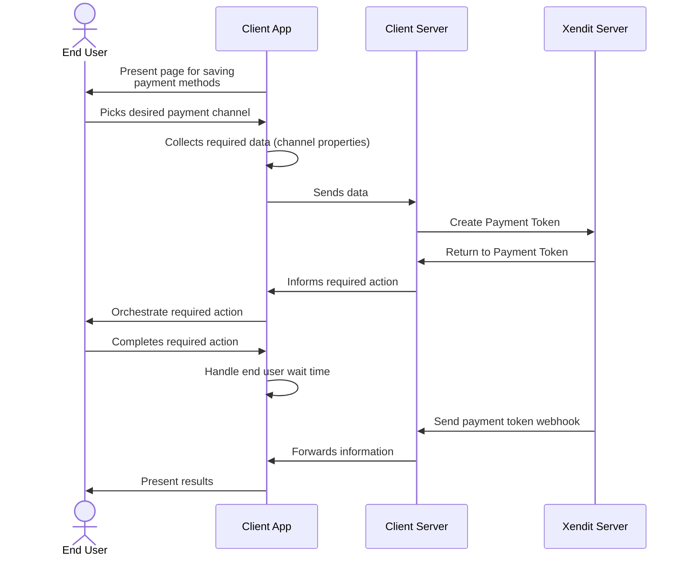
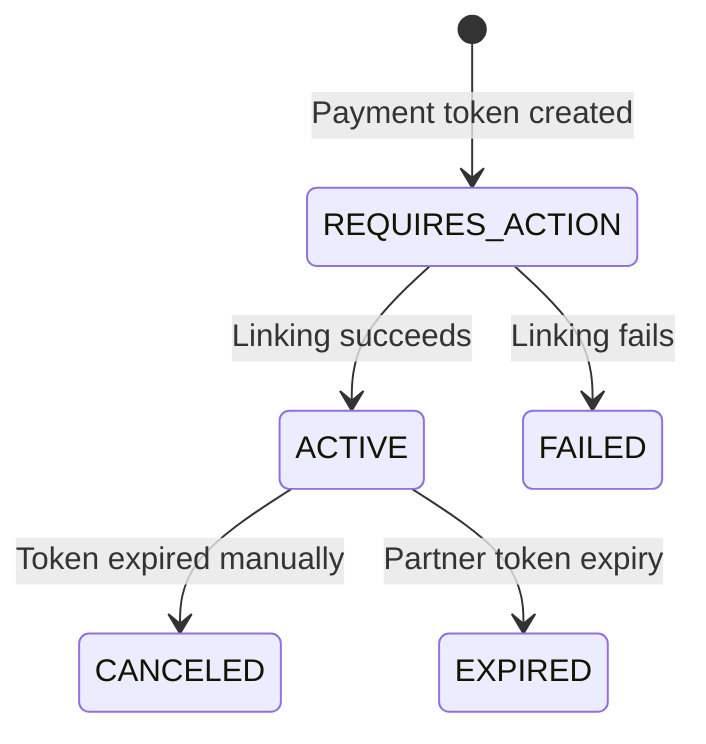

import CreatePt from '/snippets/payments-api/create-pt.mdx'
import CreatePtWebhook from '/snippets/payments-api/create-pt-webhook.mdx'

Saving the end user’s payment information for future use is a flow used to increase future payment success rates. This flow is often used by merchants who wants to manage a wallet or set of payment methods for the end user independent of payment collection.

In this article, we will walk through a basic integration with our payments API for saving payment information with `/payment_tokens` endpoint. Before you start, be sure to complete your integration environment set up.

## Integration Flow

## How to integrate

1. Create a page to display possible payment channel for saving.

   On your application, prepare a page for the end user to select and agree with saving payment information for their desired channel. The end user will pick their desired payment channel here.  
     
   Xendit recommends that you curate the list of payment channels based on preferred payment channels by the end user group that you are targeting. Other considerations might include average balance/ available credits in chosen payment methods or payment amount limits.
2. Collect required data for the chosen payment channel   
   Once the end user picks a channel, collect the data required to save the payment information.
3. Create a payment token request   
   Construct an [API request body](https://xendit-docs.document360.io/apidocs/create-payment-token) with information required by your selected channel.

   <CreatePt />
4. Handle the required actions

   Upon successful creation of a payment token request with Xendit, you will receive our payment token object. If the payment token status is `REQUIRES_ACTION`, you will need to perform some actions on the client app for the end user to complete payment. If no actions are required, the final payment status will be returned synchronously and a webhook with payment status update will be sent.

   1. Redirection

      1. Action "type": "REDIRECT\_CUSTOMER"
      2. On the client app, redirect the user to the url in action’s value. To maximise success rates, you should handle the redirection based on the user’s device type. Note that for certain payment channels, there are redirections rules for pending or cancellation. Your application should be designed to handle such scenarios.
5. Receive a payment token event webhook for payment token activation  
   Once the end user has completed their authentication step and the payment method provider notifies Xendit of an update, Xendit will proceed to send a webhook to the webhook url you configured in your Xendit dashboard settings page.

   <CreatePtWebhook />
6. Display payment token status to user

   With the webhook status, you should be able to complete the save journey for the end user by successfully completing the transaction or directing them back for a retry if it had failed.   
     
   In all real time messaging systems, there is a chance that the webhook does not reach your system. Your application should also cater for the scenario where a webhook is not received while the end user is still waiting on their screen. In such cases, it is recommended for a pending payment notice to be given to the end user while you wait for a webhook from Xendit.

## Status Lifecycle

Here’s the status lifecycle for a payment token

| Status | Description | Webhook Event |
| --- | --- | --- |
| REQUIRES\_ACTION | The payment token enters this status synchronously upon API response for the end user to complete linking process. Handle the `actions` object in this stage. | - |
| ACTIVE | The payment token transitions to this status when the linking is successfully completed. Xendit will send the payment\_token.activation webhook as the identifier that payment token is active. You should store the `payment_token_id` for use in future transactions. | - payment\_token.activation |
| FAILED | The payment token transitions to this status when the linking process fails. Xendit will send a payment\_token.failure webhook containing the `payment_token_id` as the identifier. Review the `failure_code` to determine the appropriate next steps.  Note: Not all payment channels provide notifications for failed linking processes. | - payment\_token.failure |
| CANCELED | You can manually expire the payment token that is in the `ACTIVE` status. Expire immediately transitions the payment request to `CANCELED`, and you can’t use the payment token for the transaction anymore. | - |
| EXPIRED | The payment token transitions to this status when it expires due to the payment partner’s expiry.  Note: Not all payment channels provide notifications for expiry payment token. | - payment\_token.expiry |
