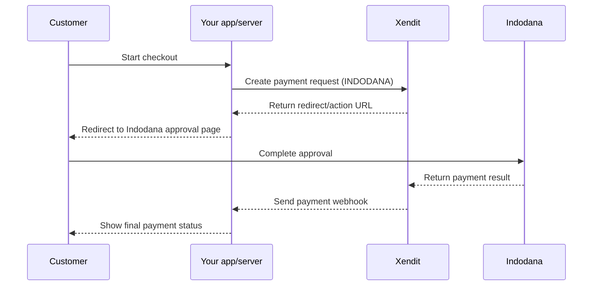

Indodana PayLater is a digital credit service that allows users to purchase goods or services on credit at various merchants partnered with Indodana Finance.

---

## Features

|  |  |
| --- | --- |
| Channel code | `INDODANA` |
| Currency | IDR |
| Minimum amount | 10,000 |
| Maximum amount | 25,000,000 |
| User approval flow | REDIRECT |
| Save | ❌ |
| Recurring | ❌ |
| Auth & capture | ❌ |
| Partial capture | ❌ |
| Multiple partial capture | ❌ |
| Payment request expiry | 24 hours |
| Payment token validity | ❌ |
| Settlement time | T+2 working days |
| Refund | ✅ |
| Partial refund | ✅ |
| Multiple partial refund | ❌ |
| Refund validity | 30 days |
| Compatible integration | [Legacy API](https://archive.developers.xendit.co/api-reference/#paylater) |

## Payment flow

