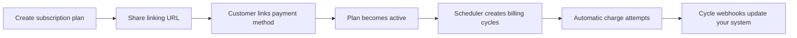

Subscriptions allows you to manage recurring payments with flexibility and ease, be it weekly, monthly, or yearly. Beyond automated scheduling, Subscriptions is designed to enhance the end-user experience and improve payment success rates with advanced features, ensuring an efficient subscription management process with low-cost integration.

## Solutions

You can set up recurring payment plans for your end users with ease. Simply define the amount, schedule, and [recovery options for failed payments](/accept-payments/payment-products/subscriptions/recover-failed-payments), and Xendit will handle the scheduling and automatic deductions. All you need to do is monitor webhook events to track payment confirmations for each billing cycle.

## Create subscriptions on the dashboard

Before you begin

To create a subscription plan, you must have at least one active payment channel that supports Merchant-Initiated Transactions.

- Check compatibility: Go to the [Available Payment Channels table](/accept-payments/payment-channel-details/available-payment-channels) and apply the Merchant-Initiated Transaction filter to see which channels support this.
- Activation: Please note that some payment channels may not be available for self-activation via the Dashboard. In these cases, please contact our CS for assistance.
- For more information on how to activate payment channels, please [click here](/accept-payments/payment-channel-details/activate-payment-channels).

How to create a subscription

1. Go to the Subscriptions page
2. Click Create Plan
3. Enter the plan details, such as your customer's info and the amount to charge
4. Select subscription cycle (weekly, monthly, etc.).
5. Configure retry settings for failed payments to maximize success rates
6. (Optional) Choose how to notify your customer about payments (i.e. email, SMS)
7. Click Create Plan
8. Share the payment link with your customer

Once your customer links their auto-debit payment method, their subscription will start automatically.

You can also download reports from the Xendit Dashboard to keep track of your subscriptions.

## Create subscriptions via API integration

1. Use API to set up the subscription plan with details such as schedule, customer information, amount, and retry configuration.
2. Once the plan is created, the API response will include a payment link URL. Redirect your customer from your app to this URL so they can complete the linking process on the Xendit-hosted page.
3. After the end user completes the linking process, they will be redirected back to your app. Your server will receive a subscription plan webhook notification, indicating that Xendit will start managing the schedule and automatically deduct the user's balance based on the defined plan.
4. Xendit will automatically attempt to recover failed payments according to the retry configuration set during plan creation
5. You will receive status updates for each subscription cycle through cycle webhooks, keeping you informed of the payment progress.

[You can find the detailed integration guide here.](/accept-payments/integration-guide/subscriptions-1/subscriptions-overview)
