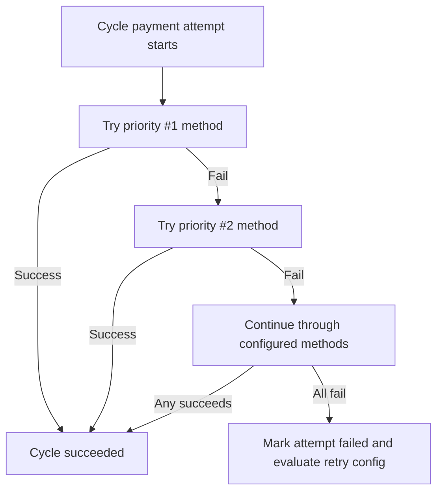
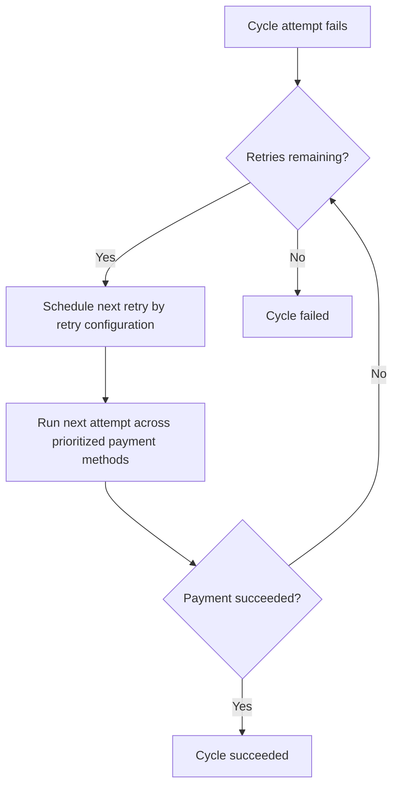

Xendit Subscriptions is designed to optimize the success rate of recurring payments, addressing the higher risk of failed payments in auto debit processes. To mitigate this, we offer features you can opt into based on your needs. These features help recover failed payments in your subscription plans and are easy to configure on your end.

## Multiple payment methods

Recurring payments often rely on a single payment method for auto debit, which increases the risk of payment failure. With Xendit Subscriptions, you can attach up to 5 payment channels for each end user’s plan, ensuring a backup option if the primary payment channel fails. You can also configure the priority order of these payment methods based on your preferences, providing greater flexibility and reducing the likelihood of failed payments.

### How it works

For each payment attempt, all attached payment channels will be processed sequentially based on the priority order you set during plan creation. If the first payment channel fails, Xendit will automatically attempt the second payment channel, and so on. Once all payment channels have been retried, Xendit will summarize the retry status before initiating the next retry cycle, ensuring efficient and comprehensive payment recovery.

You can see this documentation to guide you on how attach multiple payment methods for a subscriptions plan.

## Retry configuration

Retries are crucial for recovering failed payments in recurring transactions. They account for the varying times when end users may top up their funds in the payment channels linked to the subscription plan. This ensures a higher chance of payment recovery and minimizes potential disruptions to the recurring payment process.

### How it works

Xendit automatically manages payment retries according to the configuration set during Subscription plan creation. For each retry attempt, all attached payment channels are processed sequentially based on their priority ranking. No action is required on your end for handling failed payments. You will receive webhooks updating you on the cycle status, indicating whether the payment is successful, failed, or still undergoing retries.

## Send Payment Link for manual payment

In addition to automated retries, Xendit allows recovery of failed payments by sending a one-time Payment Link to the end user. This enables them to manually complete the payment for a specific cycle using any payment method, even if it is not attached to the subscription plan. Xendit automatically sends a notification with the Payment Link URL for each failed payment attempt.

Once the end user completes the payment through the Payment Link, the retry process for that specific cycle will stop, as the payment is already settled. The payment method used to complete the one-time Payment Link will not be saved or replace the payment methods registered for the subscription. For subsequent cycles, retries will continue with the payment methods originally attached to the subscription.

