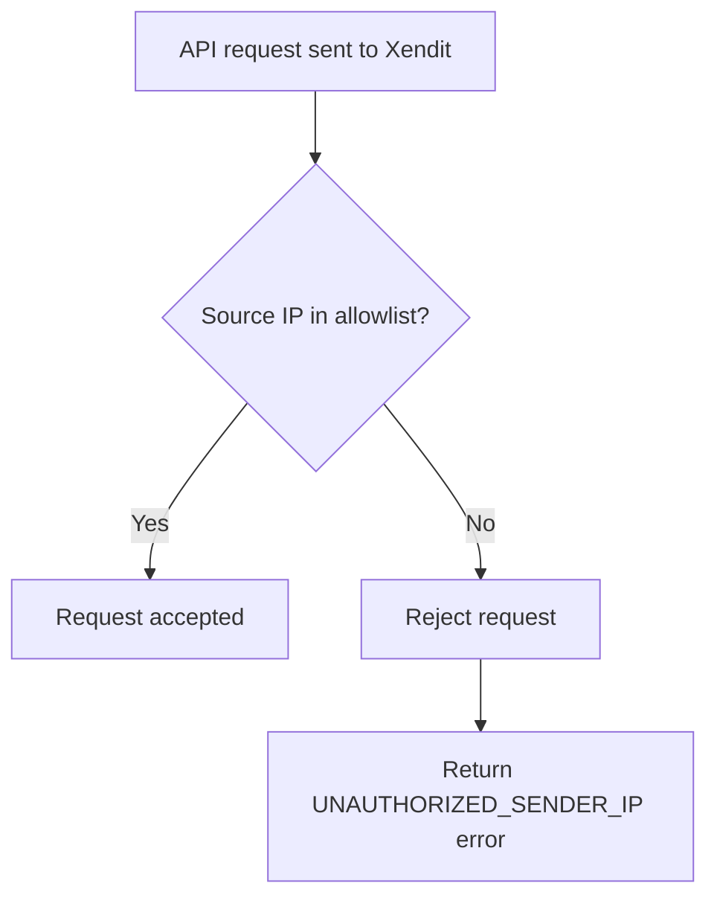

IP Allowlist is a feature to secure API traffic against foreign or malicious IPs by allowing only specific IP addresses or ranges of your choice to access Xendit APIs. Traffic coming from allowlisted IPs will be allowed, whereas traffic from non-allowlisted IPs will be rejected

<Info>
##### INFO

IP Allowlist feature only works for API users through direct API integration and will not work for plugin users (Shopify, woocommerce, etc).
</Info>



<Info>
##### INFO

Only users who have Admin permission can access IP Allowlist feature in Dashboard.

## Features
</Info>

IP addresses can be allowlisted in IPv4 format and CIDR format. CIDR, which stands for Classless Inter-Domain Routing (CIDR), is a range of IP addresses a network uses. A CIDR address looks like a normal IP address, except that it ends with a slash followed by a number. The number after the slash represents the number of addresses in the range. Example of CIDR IP address in IPv4: 192.0.2.0/24. This means the address range has 256 addresses after 192.0.2.0. Learn more.

### Add IP addresses

To add your IP address, visit IP Allowlist settings in Dashboard.

<Info>
##### INFO

If there are no allowlisted IPs, Xendit will not validate any IPs from API requests.
</Info>


Click the Add IP Address button, then add all the IP addresses you want to allowlist. You can add more than one IP address at a time by entering a new line for each IP address in the input box.

### Delete IP addresses

When you need to remove any IPs from the allowlist, you can use the select the IP address you wish to delete, and click the Delete button on the top right corner.


## Testing IP Allowlist

After you have allowlisted your server IPs, then the expected result is only the registered IP address(es) can access Xendit API. Hence, you can validate the behavior by hitting the Xendit API from the allowlisted IP and non-allowlisted IP, then see the result. You can validate by following these steps:

1. Prepare the IP address location that you want to test. You can use your computer by finding out the IP address here.
2. Prepare your API testing setup using Postman by following this instruction here or using your API call to Xendit API.

Example: You have allowlisted IP yy.yy.yyy.yyy. When you hit Create Invoice API using non-allowlisted IP address, then the result will be displayed as follow:

```json
{
   "error_code": "UNAUTHORIZED_SENDER_IP",
   "message": "Your request from IP xxx.xxx.xxx.xxx was rejected as it hasn't been added to IP Allowlist. Visit https://dashboard.xendit.co/settings/developers#ip-allowlist to check and add your server IPs to IP Allowlist"
}
```

When you create an API request, for example to Create Invoice API, if the request's IP address is in the list of IP Allowlist, then the request IP is verified and API request will proceed as normally. Example a successful request to Create Invoice API using allowlisted IP


