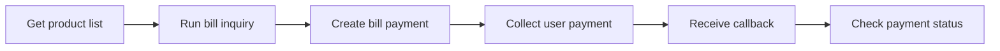

Integrating with Xendit Bill Payments is straightforward and follows a consistent flow. This guide will walk you through the key endpoints and integration steps to help you implement Bill Payments in your application.

## Integration Flow



Xendit Bill Payment APIs Overall Flow

The Bill Payments API follows a 6-step process:

1. Product List - Get available products from Xendit
2. Bill Inquiry - Send inquiry request to check bill details
3. Bill Payment - Initiate bill payment
4. Payment Collection - Collect payment from users through [Xendit Payment API](/accept-payments/payment-products/payments-api-intro/how-payments-api-work)
5. Receive Callback - Get notified about payment status
6. Payment Status - Check bill payment details via GET endpoint

### Base URL

```plaintext
https://api.xendit.co/bill-payments
```

### Core API Endpoints

| Endpoint | Purpose | Key Features |
| --- | --- | --- |
| `GET /v1/product` | Gets available products with optional filtering | - Filtering by multiple criteria - Availability status - Complete product pricing details |
| `POST /v1/inquiry` | Verifies bill details before payment | - Standardized response across billers - Organized information structure - Pre-payment validation |
| `POST /v1/payment` | Submits payment for a specific product | - Idempotency protection - Async processing |
| `GET /v1/payment/{id}` | Retrieves detailed payment information | - Complete transaction details - Detailed success/failure info - Payment proof details |
| Callback | Notifies merchants when payment is completed | - Signature validation - Retry mechanism - Essential transaction information |

## Integration Steps

1. Authentication

   Use your Xendit API key in the Authorization header:

   ```plaintext
   Authorization: Basic &lt;Base64 encoded API key&gt;

   ```
2. Get Available Products

   Retrieve the list of available bill payment products to display to your users:

   ```plaintext
   GET /v1/product?category=ELECTRICITY

   ```
3. Verify Bill Details

   When a user enters their customer number, verify the bill details:

   ```plaintext
   POST /v1/inquiry

   ```
4. Process Payment

   After the user confirms the payment, initiate the transaction:

   ```plaintext
   POST /v1/payment

   ```
5. Handle Callback

   Set up a secure endpoint to receive payment status updates from Xendit.
6. Check Payment Status

   For additional verification or user inquiries:

   ```plaintext
   GET /v1/payment/{id}

   ```

## Best Practices

- Implement Idempotency: Use idempotency keys for payment requests to prevent duplicate transactions.
- Verify Signatures: Always validate callback signatures to ensure request authenticity.
- Error Handling: Implement proper retry logic and monitor for error patterns.
- Status Checking: Don't rely solely on callbacks; implement status checking, it is mandatory.
- Timeout Management: Set appropriate timeouts for API requests.
- Webhook Processing: Process callbacks asynchronously for better system performance.

## Error Scenarios

When integrating with Bill Payments API, you may encounter various error scenarios. Understanding these errors and implementing proper handling will ensure a smooth user experience.

### Common Error Categories

| Category | Description | Example |
| --- | --- | --- |
| Customer Validation | Errors related to customer information | Invalid customer number, duplicate reference ID |
| Bill Status | Errors related to bill payment status | Bill already paid, no outstanding bills |
| System | Errors from biller systems or Xendit | Timeout, maintenance, general errors |
| Product | Errors related to product availability | Product not found, temporarily unavailable |
| Transaction | Errors during transaction processing | Insufficient balance, exceeding limits |

### Failure Codes

| Error Code | HTTP Status | Description | Handling Recommendation |
| --- | --- | --- | --- |
| `CUSTOMER_NOT_FOUND` | 404 | Customer number not found in biller's system | Prompt user to verify their account number |
| `DUPLICATE_REFERENCE_ID` | 409 | Reference ID already used | Generate a new unique reference ID |
| `BILL_ALREADY_PAID` | 409 | Bill has been paid | Inform user the bill is already settled |
| `NO_OUTSTANDING_BILL` | 404 | No pending bills found | Notify user there are no bills to pay |
| `BILLER_TIMEOUT` | 504 | Biller system timeout | Implement retry with exponential backoff |
| `BILLER_MAINTENANCE` | 503 | Biller system under maintenance | Show maintenance schedule if available |
| `BILLER_ERROR` | 502 | General biller error | Display generic error with retry option |
| `PRODUCT_NOT_FOUND` | 404 | Product not found | Verify product code or availability |
| `BALANCE_INSUFFICIENT` | 402 | Insufficient merchant balance | Top up merchant balance |

### Error Handling Strategies

1. Retry Logic

   Implement exponential backoff for retrying failed requests:

   - First retry: 15 minutes after initial attempt
   - Second retry: 45 minutes after first retry
   - Third retry: 2 hours after second retry
   - Fourth retry: 3 hours after third retry
   - Fifth retry: 6 hours after fourth retry
   - Final retry: 12 hours after fifth retry
2. User Communication

   Translate technical error codes into user-friendly messages:

   - For `CUSTOMER_NOT_FOUND`: "The account number you entered was not found. Please check and try again."
   - For `BILL_ALREADY_PAID`: "This bill has already been paid. No further action needed."
   - For system errors: "We're having trouble connecting to the service provider. Please try again in a few minutes."
3. Fallback Mechanisms

   Implement fallback options when primary functions fail:

   - If inquiry fails, provide manual input option
   - If payment fails, suggest alternative payment methods
   - If callbacks aren't received, implement status polling
4. Logging and Monitoring

   Maintain detailed logs for troubleshooting:

   - Log all request/response pairs with timestamps
   - Monitor error rates by category
   - Set up alerts for unusual error patterns
5. Security Measures

   Protect your integration from common security issues:

   - Verify callback signatures using the provided secret
   - Validate timestamp to prevent replay attacks
   - Implement idempotency for all payment operations

By understanding these error scenarios and implementing proper handling strategies, you can provide a reliable bill payment experience to your users while minimizing support issues.
