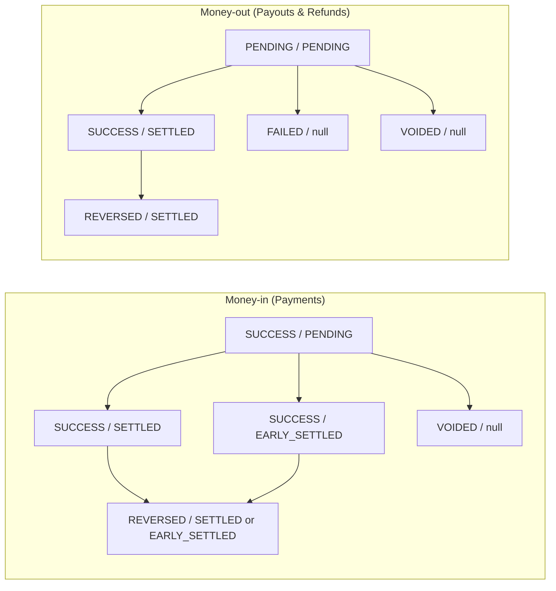

Use this reference to read the pair of fields `transaction_status` and `settlement_status` you see in the Dashboard, API responses, and reports.

High-level flow of status transitions

## Money-in (Payments)

The table below maps each payment phase to its `transaction_status` and `settlement_status`.

| Phase | Transaction Status | Settlement Status | Meaning |
| --- | --- | --- | --- |
| Payment success | SUCCESS | PENDING | Funds captured; will be settled automatically on `settlement_date`. |
| Settlement complete — normal | SUCCESS | SETTLED | Funds posted on the scheduled settlement date. |
| Settlement complete — early | SUCCESS | EARLY\_SETTLED | Funds posted *before* the scheduled settlement date. |
| Cancelled before settlement | VOIDED | null | Payment voided before any ledger posting. |
| Reversal after settlement | REVERSED | SETTLED / EARLY\_SETTLED | Transaction reversed manually after settlement. |

## Money-out (Payouts & Refunds)

The same two fields apply to outgoing funds. Interpret them using the table below.

| Phase | Transaction Status | Settlement Status | Meaning |
| --- | --- | --- | --- |
| Payout created | PENDING | PENDING | Transaction created; processing with partner. |
| Failed payout | FAILED | null | Partner rejected the payout. |
| Payout success | SUCCESS | SETTLED | Funds debited and ledger movement completed. |
| Cancelled before settlement | VOIDED | null | Transaction cancelled before settlement. |
| Reversal after settlement | REVERSED | SETTLED | Payout manually reversed during reconciliation. |
