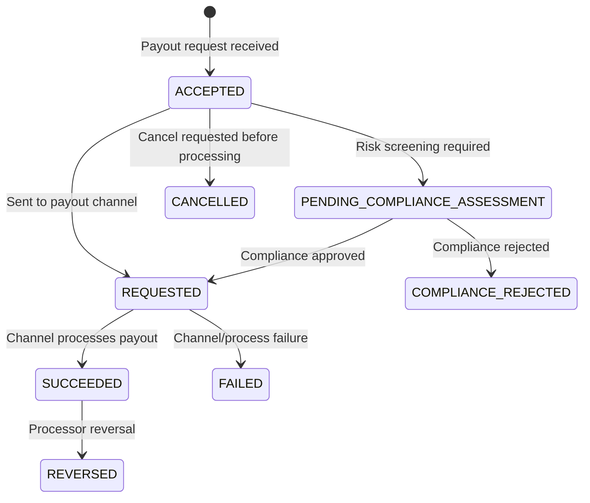

The diagram below illustrates the end-to-end journey of a payout, starting from your request to its completion. You can refer to the Payout Statuses section for detailed description of each status types.

\*Note that `SUCCEEDED` transactions may be `REVERSED` on reversals by the processing network.

### Payout

## Payout Statuses

The following table describes a detailed description of each payout status types.

| Code | Description |
| --- | --- |
| `ACCEPTED` | The payout request has been accepted by Xendit but not sent to the destination. A payout may remain in this status if the chosen destination is currently offline. Xendit will process this automatically when the destination comes back online. |
| `PENDING_COMPLIANCE_ASSESSMENT` | Request is considered risky and is being reviewed by our compliance team. Our team will contact you via email for extra information on enhanced due diligence. |
| `COMPLIANCE_REJECTED` | Request is rejected for compliance reasons. |
| `REQUESTED` | The payout has been sent to the channel. Funds have been sent to the channel for processing. |
| `FAILED` | Payout failed. See possible reasons in Failed Reasons section. |
| `SUCCEEDED` | Payout has been sent. |
| `CANCELLED` | Payout has been cancelled per your request. |
| `REVERSED` | Payout was rejected by processor after the payout succeeded. Commonly due to invalid or dormant account. |

## Track your Payouts

Always be on top of your payout’s statuses. You can learn about a payout’s status from the following methods:

1. Subscribe to our [webhook events](/send-money/integration-setup-2/payouts-set-up-webhooks) - (Required for API integration)
2. Open the payout’s transaction detail in your [Transaction Tab](https://dashboard.xendit.co/transactions-new)

## Failed Reasons

You can learn about the cause of a failure from the `failure_code` field of a failed payout.

After a payout status is `REQUESTED`, it may fail our payout processing or be rejected by the recipient bank, at which point its status will transition to `FAILED`. Subscribe to [Payout webhook events](/send-money/integration-setup-2/payouts-set-up-webhooks) to receive real-time notifications of each payout's failure and its reason.

It is important that you understand each failure code in detail in order to decide on the appropriate action to take. Below is a comprehensive list of the possible failure codes that you may receive, what they mean and what our corresponding suggested action is:

| Error | Description | Retry? | Notes on Retry |
| --- | --- | --- | --- |
| `INSUFFICIENT_BALANCE` | Client has insufficient balance for the payout amount | ✅ | Retry the payout after ensuring that you have sufficient balance in your account |
| `INVALID_DESTINATION` | The recipient account does not exist/is invalid | ❌ | You are unlikely to succeed if you retry the same payout request. Please confirm with the recipient whether their account is correct |
| `DESTINATION_MAXIMUM_LIMIT` | The recipient is unable to receive the funds due to the payout amount exceeding the recipient’s ability to receive | ❌ | You are unlikely to succeed if you retry the same payout request. Please confirm with the recipient whether their account can receive the payout |
| `ACCOUNT_NAME_MISMATCH` | Payout failed due to invalid account name. | ❌ | You are unlikely to succeed if you retry the same payout request. Please confirm with the recipient on the valid account name. |
| `REJECTED_BY_CHANNEL` | Payout failed due to an error from the destination channel. This is usually because of issues crediting funds into the destination bank account | ✅ | Retry the payout after validating that the destination bank account number is active and can receive funds in your chosen currency |
| `TEMPORARY_TRANSFER_ERROR` | The channel networks are experiencing a temporary error | ✅ | Retry the payout in 1-3 hours |
| `TRANSFER_ERROR` | We’ve encountered a fatal error while processing this payout. Normally, this means that certain API fields in your request are invalid | ❌ | You are unlikely to succeed if you retry the same payout request. |
